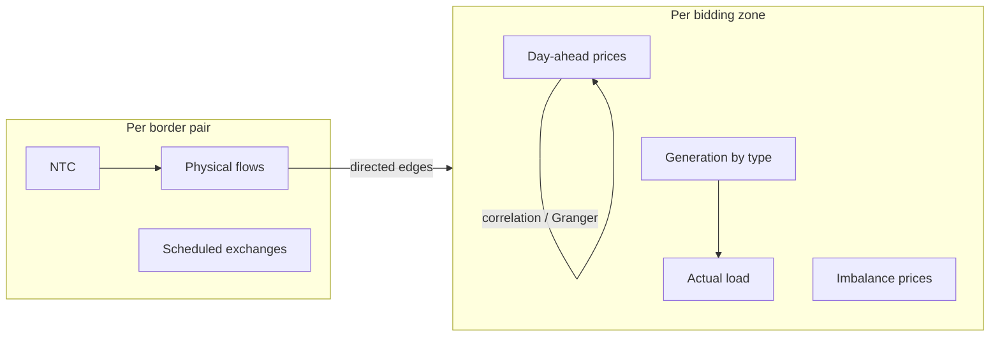

# ENTSO-E Data Guide (2025)

**Project:** Data-Driven Dependency Mapping of European Energy Infrastructure  
**Supervisor:** Stefan  
**Source:** [ENTSO-E Transparency Platform](https://transparency.entsoe.eu/) — official data from European TSOs

## Why ENTSO-E first

Per Stefan's guidance, we start with ENTSO-E before combining with other sources (e.g. PyPSA-Eur OSM grid). ENTSO-E provides authoritative **time-series market data** directly from transmission system operators, with consistent pan-European coverage under EU Regulation 543/2013.

## Datasets collected

| Dataset | ENTSO-E article | Resolution | Coverage | Role in dependency mapping |
|---------|-----------------|------------|----------|---------------------------|
| **Day-ahead prices** | 12.1.D (A44) | Hourly | ~44 bidding zones | Price coupling — how shocks propagate across markets |
| **Actual load** | 6.1.A (A65) | Hourly | Per zone | Demand-side stress indicator |
| **Generation by type** | 16.1.B&C (A75) | Hourly | Per zone, by fuel (PSR) | Supply composition (nuclear, wind, solar, gas, …) |
| **Cross-border flows** | 12.1.G (A11) | Hourly | Directed border pairs | Direct physical interconnection dependency |
| **Scheduled exchanges** | 12.1.E (A09) | Hourly | Border pairs | Commercial/trade coupling |
| **Net transfer capacity** | 11.1 (A61) | Hourly | Border pairs | Transfer constraints on interconnections |
| **Imbalance prices** | 17.1.G (A85) | Sub-hourly | Per zone | Balancing stress / system tightness |

## Geographic scope

- **45 bidding zones** across the EU coupling region (ENTSO-E member states + GB, CH, NO, etc.)
- **~150+ directed border pairs** derived from zone adjacency
- Cyprus excluded (isolated island system, not in API client)
- Internal Italian zones (NORTH, CNOR, CSUD, SUD, SICI, SARD) collected separately

## Storage layout

```
data/raw/entsoe/
├── day_ahead_prices/{zone}/2025-01-01_2026-01-01.parquet
├── actual_load/{zone}/...
├── generation_actual/{zone}/...
├── crossborder_flows/{from}>{to}/{month}.parquet
└── ...
```

Each parquet file contains: `timestamp` (UTC), `value`, plus zone/border identifiers.

## Known data gaps

- **NTC for internal Italian island links** (Sicily↔Sardinia, Sicily↔South): often no data — these are internal, not cross-border in ENTSO-E terms
- **Some border pairs**: physical flows may be zero or unavailable for non-interconnected pairs
- **Imbalance prices**: resolution varies by TSO (15-min or hourly)

## Key relationships for dependency analysis



**Cross-border flows** are the most direct signal for building a dependency graph: a directed edge from zone A→B with hourly MW values shows physical power transfer.

**Day-ahead prices** reveal coupling: correlated price movements across zones indicate market integration even without explicit flows.

## Next steps (analysis phase)

1. **Consolidate** raw parquets into single files per dataset (`energy-collect validate --year 2025`)
2. **Exploratory analysis**: price correlation matrix across zones, flow networks, generation mix
3. **Dependency graph construction**: edges weighted by flow magnitude, price correlation, or Granger causality
4. **Later**: layer static infrastructure (PyPSA-Eur grid, GEM plants) only where it adds structural context — step-by-step per Stefan

## Commands

```bash
# Check collection progress
energy-collect status

# Resume interrupted collection
energy-collect entsoe --year 2025 --all-zones --resume

# Validate + build processed files
energy-collect validate --year 2025

# Profile what we have
python3 scripts/profile_entsoe.py
```

## Timeline estimate for Stefan

| Milestone | Status |
|-----------|--------|
| API key + framework | Done |
| 2025 zone-level data (prices, load, gen, imbalance) | Done (~44 zones × 4 datasets) |
| 2025 border-pair data (flows, exchanges, NTC) | In progress (~80% complete) |
| Validation report + processed files | After collection completes |
| Initial exploratory analysis (correlations, flow graph) | 1–2 days after data complete |
| Written data understanding summary | This document + profile JSON |

**Realistic answer to "when do you have data in place":** zone-level 2025 data is already usable today; full border-pair coverage within ~1–2 hours of resumed collection; initial understanding document ready now, deeper analysis within a few days.
